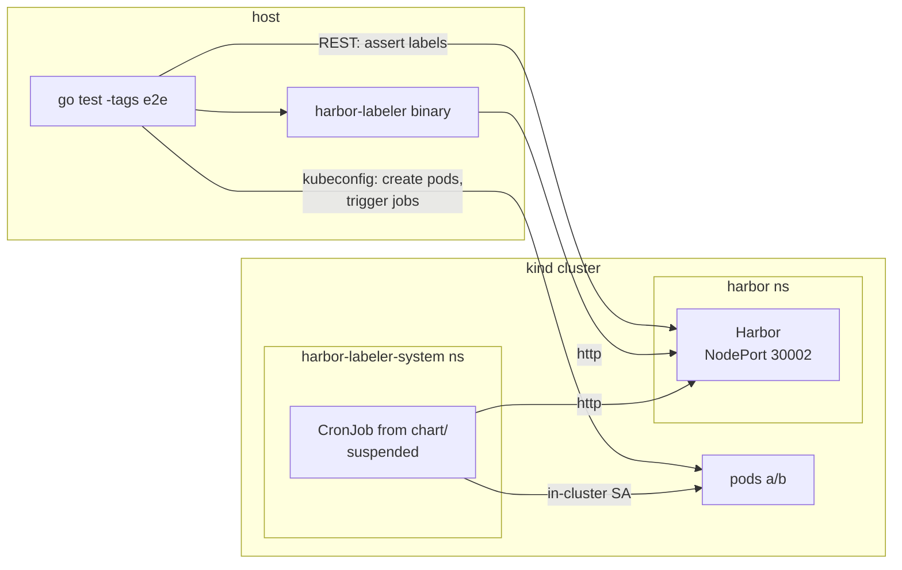
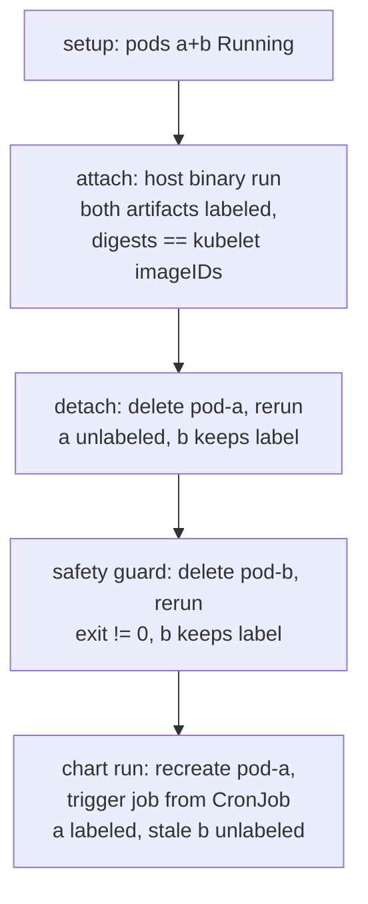

# End-to-end tests

Real-infrastructure verification of harbor-labeler: a kind cluster with a
real Harbor (official helm chart) deployed inside it, real pods, the real
binary, and the real harbor-labeler helm chart running in-cluster. The unit
tests (`go test ./...`) prove the reconcile logic against fakes; this suite
proves the contracts the fakes merely assume.

```bash
./e2e/run.sh                # from the repo root, inside `nix develop`
KEEP_CLUSTER=1 ./e2e/run.sh # leave the kind cluster running for debugging
```

Needs docker and nix; Linux only (the host must reach the kind node's
docker-network IP directly). First run pulls ~2 GiB of Harbor images and
takes ~10 min; warm runs finish in ~3 min. CI runs the suite on pull
requests and on manual dispatch (`.github/workflows/e2e.yml`) — it cannot
run under nixbot because the nix build sandbox has no docker.

## Topology

`run.sh` provisions everything, then hands off to `go test -tags e2e`:



Everything addresses Harbor by one name, `<node-ip>:30002` — reachable from
the host (docker network route), from pods (NodePort), and from the node's
containerd (plain-http `hosts.toml`). That single-hostname setup mirrors
production and is load-bearing: the labeler only considers images whose
`imageID` host equals the `HARBOR_URL` host. Harbor living *inside* the
cluster is provisioning convenience only; to every component under test it
is an opaque HTTP endpoint, exactly like an external Harbor.

## Scenario

One test, ordered subtests, each stage building on the previous state:



## What it covers

- **Harbor v2 API contract** — label search query syntax, artifact listing,
  attach/detach semantics, against a real Harbor instead of an `httptest`
  fake that encodes our own assumptions.
- **Real kubelet/containerd `imageID`** — the digest reported for a running
  pod matches the manifest digest Harbor stores (including docker-buildx
  manifest lists). The unit fakes return whatever the test plants.
- **Binary wiring** — env config, kubeconfig resolution, exit codes,
  including the zero-images safety guard leaving Harbor untouched.
- **The deployment artifact itself** (chart run stage) — chart rendering,
  the nix-built OCI image actually starting, in-cluster service account
  auth (`rest.InClusterConfig`), the ClusterRole granting cluster-wide pod
  list, and the NetworkPolicy egress rules admitting DNS + API server +
  Harbor.

## What it does not cover

- **TLS / custom CAs** — Harbor runs plain http here. The `customCAs` chart
  values (CA bundle mount + `SSL_CERT_DIR`) are rendered by unit-level
  `helm template` review only; TLS termination itself is stock `net/http`.
- **The CronJob schedule firing** — the chart is installed `suspend=true`
  and the test creates a Job from the CronJob template (what
  `kubectl create job --from=cronjob/...` does). Kubernetes' cron mechanics
  are not ours to test.
- **Same digest in multiple repositories** — containerd dedupes images by
  digest, so the kubelet reports one repository per digest. An image
  promoted unchanged to a second repo may get its label stripped there
  while running. Known limitation; the test images are built with distinct
  digests to keep the stages deterministic.
- **Scale** — two pods, one project. Pagination paths are unit-tested only.

## Files

- `run.sh` — provisioning + teardown; exports the env contract
  (`HARBOR_URL`, `LABELER_BIN`, `E2E_IMAGE_*`, `E2E_CRONJOB*`, ...) and runs
  the suite.
- `e2e_test.go` — the scenario; `//go:build e2e`, skips without
  `LABELER_BIN` so a bare `go test -tags e2e ./e2e` stays green.
